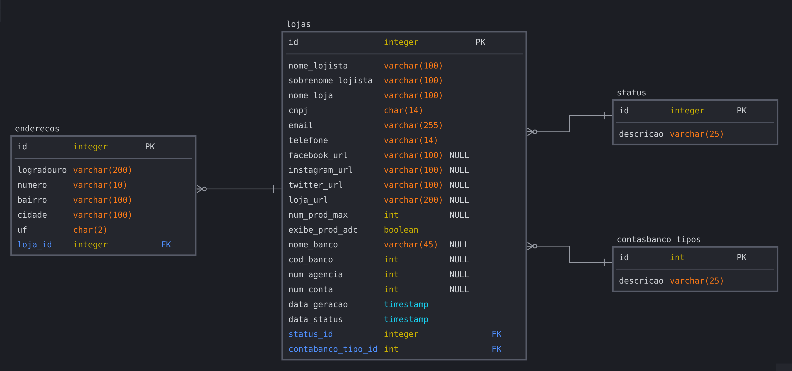

# Levantamento de Requisitos

# Documentação da API de Cadastro de Lojistas

Esta documentação descreve os requisitos e funcionalidades da API de Cadastro de Lojistas para uma plataforma de e-commerce, utilizando as tecnologias Lombok, Spring Boot, MySQL e Java 21.

## Tecnologias Utilizadas

- **Lombok:** Biblioteca Java que ajuda a reduzir a quantidade de código boilerplate.
- **Spring Boot:** Framework Java para criar aplicativos baseados em Spring de forma rápida e fácil.
- **MySQL:** Sistema de gerenciamento de banco de dados relacional.
- **Java 21:** Versão mais recente do Java na época do desenvolvimento.

## Requisitos Funcionais:

Registro de Lojista:
Os lojistas devem ser capazes de se registrar na plataforma fornecendo informações básicas, como nome da loja, CNPJ, endereço físico e de e-mail, telefone de contato e uma senha segura.
O sistema deve validar o CNPJ fornecido para garantir sua autenticidade.
Após o registro bem-sucedido, os lojistas devem receber um e-mail de confirmação.

Autenticação:
Os lojistas registrados devem poder fazer login na plataforma usando seu CNPJ/e-mail e senha.
A autenticação deve ser protegida por meio de técnicas como hashing de senha e tokens de autenticação JWT (JSON Web Tokens).
O sistema deve fornecer um mecanismo para redefinição de senha caso os lojistas a esqueçam.

Gestão de Produtos:
Os lojistas devem poder adicionar novos produtos especificando detalhes como nome, descrição, preço, quantidade em estoque, categoria, imagens, etc.
Eles devem ser capazes de atualizar e excluir produtos existentes.
A API deve suportar operações de busca para que os lojistas possam encontrar facilmente produtos em seu catálogo.

Gestão de Pedidos:
Os lojistas devem ter acesso aos detalhes dos pedidos recebidos, incluindo informações do cliente, produtos comprados, status do pedido, etc.
Eles devem poder atualizar o status do pedido conforme o progresso (por exemplo, "recebido", "em processamento", "enviado", "entregue", etc.).
A API deve permitir a geração de faturas e recibos para os pedidos.

Integração de Pagamento:
Os lojistas devem ser capazes de integrar métodos de pagamento populares à sua loja, como cartões de crédito, PayPal, boleto bancário, etc.
A API deve fornecer endpoints seguros para processar transações de pagamento de forma transparente e segura.
O sistema deve registrar e notificar os lojistas sobre o status das transações (por exemplo, "pago com sucesso", "pendente", "falha na transação", etc.).

Relatórios de Vendas:
Os lojistas devem poder gerar relatórios detalhados sobre suas vendas, incluindo métricas como receita total, número de pedidos, produtos mais vendidos, etc.
A API deve suportar filtros e opções de personalização para que os lojistas possam analisar suas vendas de acordo com suas necessidades específicas.
Os relatórios devem ser exportáveis em formatos comuns, como CSV ou PDF, para facilitar a análise e o compartilhamento.

## Requisitos Não Funcionais:

Segurança: Garantir que os dados dos lojistas e clientes estejam protegidos por medidas como criptografia de dados e autenticação segura.
Implementar práticas de segurança para evitar ameaças como injeção de SQL e XSS, utilizando cookie de sessão.

Desempenho:
A API deve ser otimizada para garantir tempos de resposta rápidos, mesmo durante períodos de alto tráfego.
As consultas ao banco de dados devem ser eficientes, utilizando índices adequados e consultas otimizadas para minimizar o tempo de execução.
Deve ser implementado um sistema de cache para armazenar em cache dados frequentemente acessados e reduzir a carga no banco de dados.

Escalabilidade: Projetar a API para ser escalável, permitindo que ela cresça conforme a demanda, tanto em termos de número de lojistas quanto de volume de transações.

Disponibilidade: Deve ser implementado um sistema de monitoramento para detectar falhas e degradação de desempenho em tempo real, com alertas configurados para a equipe de operações.
Deve ser realizada uma estratégia de backup regular e testes de recuperação de desastres para garantir a recuperação de dados em caso de falha do sistema.

A documentação da API deve ser abrangente, detalhando todos os endpoints disponíveis, os parâmetros necessários para cada chamada, os códigos de status retornados e exemplos de uso.
A documentação deve ser atualizada regularmente para refletir quaisquer alterações ou atualizações na API.

Compatibilidade: Certificar-se de que a API seja compatível com as tecnologias especificadas (Lombok, Spring Boot, MySQL e Java 21) e que possa ser facilmente integrada com outras ferramentas e sistemas e deve ser garantida a compatibilidade com uma variedade de navegadores e dispositivos, para garantir uma experiência consistente para os lojistas que acessam a plataforma de diferentes plataformas.

## Infraestrutura Api e Banco de dados:

**APIs**:
   - Implementaremos a API de Cadastro de Lojistas utilizando Spring Boot, que irá lidar com o registro de lojistas, autenticação, gestão de produtos, gestão de pedidos, integração de pagamento e relatórios de vendas.
   - Protegeremos a autenticação utilizando JWT para gerar tokens de acesso e refresh.
   - Utilizaremos técnicas de criptografia para proteger os dados sensíveis, como senhas e informações de pagamento.
   - Implementaremos endpoints RESTful para cada funcionalidade da API, seguindo as práticas recomendadas de design de API.
 
 **Banco de Dados**:
   - Utilizaremos MySQL como sistema de gerenciamento de banco de dados relacional para armazenar informações dos lojistas, produtos, pedidos, transações de pagamento e relatórios de vendas.
   - iremos modelar o banco de dados de acordo com as necessidades da aplicação, garantindo eficiência e integridade dos dados.
---

### Campos

#### Lojista

| Campo                   | Tipo           | Obrigatório |
| ----------------------- | -------------- | ----------- |
| **nome_loja**           | string         | SIM         |
| **nome_lojista**        | string         | NAO         |
| **sobrenome_lojista**   | string         | NAO         |
| **cnpj**                | string         | SIM         |                
| **email**               | string         | SIM         |
| **telefone**            | string         | SIM         |
| **endereco.logradouro** | string         | SIM         |
| **endereco.numero**     | string         | SIM         |
| **endereco.bairro**     | string         | SIM         |
| **endereco.cidade**     | string         | SIM         |
| **endereco.uf**         | string         | SIM         |
| **facebook_url**        | string         | NAO         |
| **instagram_url**       | string         | NAO         |
| **twitter_url**         | string         | NAO         |
| **loja_url**            | string         | NAO         |
| **num_prod_max**        | integer        | NAO         |
| **exibe_prod_ad**       | boolean        | NAO         |
| **nome_banco**          | string         | NAO         |
| **num_agencia**         | string         | NAO         |
| **num_conta**           | string         | NAO         |
| **cod_banco**           | string         | NAO         |

### Endpoints
| Função                           | Método  | Endpoint                                       |
| -------------------------------- | ------- | ---------------------------------------------- |
| **Requisição de Cadastro**       | POST    | `lojista/cadastro`                             |
| **Listar Requisições**           | GET     | `admin/requisicoes-cadastro`                   |
| **Aprovar Requisição**           | POST    | `admin/cadastro/{id}/aprovar`                  |
| **Aprovar Requisição**           | POST    | `admin/cadastro/{id}/negar`                    |
| **Listar Lojistas**              | GET     | `admin/listar-lojistas`                        |

## Modelagem BD

## Board Kanban:

Link: https://trello.com/b/MVjFrjpx/kanban

## Como Usar

1. Clone este repositório.
2. Certifique-se de ter todas as dependências e tecnologias instaladas e configuradas corretamente.
3. Execute a aplicação.
4. Utilize as rotas da API conforme descrito na documentação para interagir com o sistema de cadastro de lojistas.

## Colaboradores
Caio Monteiro

Gabriel Afonso

Marcus Vinicius 

João Gois

Felipe Seda

